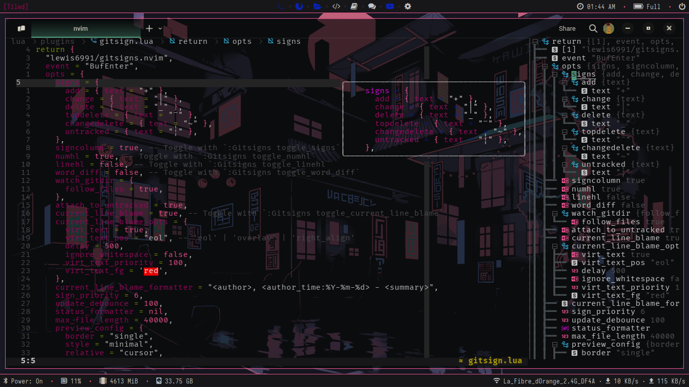

# Yet another humble attempt

# nvim/

<a href="https://dotfyle.com/Yeeloman/nvim"></a>
<a href="https://dotfyle.com/Yeeloman/nvim"></a>
<a href="https://dotfyle.com/Yeeloman/nvim"></a>


The project still lacks proper documentation and has a few more steps to go, but it’s in a state where I feel comfortable showcasing it. Of course, no configuration is ever truly "finished"—we all love to tweak and refine things to better suit our workflow.

## Overview

This setup is structured around two main sections:

- **Config:** Contains general Neovim settings, key mappings, autocommands, and lazy.nvim integration.  
- **Plugins:** A collection of highly customizable plugins, primarily focused on enhancing aesthetics and usability.  

Since I love a well-polished visual experience, many of the plugins here are chosen for their customization potential. I'll be documenting both the plugins and the actual config files—one step at a time.  

### Extendability & Theming  

The setup is easily extendable and integrates **NeoPywal** to dynamically apply colors from the `wal` command output. So far, this method has been used mainly for theming, but I'm open to suggestions for improvements or additional plugins/configs worth trying.

#### Preview
To clarify any confusion about the `current_wallpaper.txt` file, I have a script that runs at boot to randomly set the wallpaper.
```bash
#!/usr/bin/env bash

# Set the wallpapers directory
WALLPAPER_DIR="$HOME/.config/nvim/.wallpapers"

# Check if directories and files exist
if [ ! -d "$WALLPAPER_DIR" ]; then
    echo "Wallpaper directory not found: $WALLPAPER_DIR"
    exit 1
fi

# Choose a random image
WALLPAPER=$(find "$WALLPAPER_DIR" -type f | shuf -n 1)

# Check if a wallpaper was found
if [ -z "$WALLPAPER" ]; then
    echo "No wallpapers found in directory: $WALLPAPER_DIR"
    exit 1
fi

# Apply the wallpaper using wal
wal -i "$WALLPAPER" --backend haishoku -q --saturate 0.9

# Export the chosen wallpaper path to a file
echo "$WALLPAPER" > "$HOME/.config/nvim/lua/current_wallpaper.txt"
```
besides that here are some previews:

<p align="center">
  
  
  
  
  
  
</p>

When it comes to syntax highlighting, the color distribution in Neopywal works relatively well. However, there are instances where the colors are too dark, making the text hard to read. To address this, I plan to create a dedicated color scheme that adapts to the wallpaper's colors. Hopefully, I can implement this soon.


## Plugins

### ai

+ [Exafunction/codeium.nvim](https://dotfyle.com/plugins/Exafunction/codeium.nvim)
### bars-and-lines

+ [utilyre/barbecue.nvim](https://dotfyle.com/plugins/utilyre/barbecue.nvim)
+ [Bekaboo/deadcolumn.nvim](https://dotfyle.com/plugins/Bekaboo/deadcolumn.nvim)
+ [SmiteshP/nvim-navic](https://dotfyle.com/plugins/SmiteshP/nvim-navic)
### color

+ [miversen33/sunglasses.nvim](https://dotfyle.com/plugins/miversen33/sunglasses.nvim)
+ [folke/twilight.nvim](https://dotfyle.com/plugins/folke/twilight.nvim)
### colorscheme-creation

+ [rktjmp/lush.nvim](https://dotfyle.com/plugins/rktjmp/lush.nvim)
### colorscheme-switchers

+ [zaldih/themery.nvim](https://dotfyle.com/plugins/zaldih/themery.nvim)
### comment

+ [danymat/neogen](https://dotfyle.com/plugins/danymat/neogen)
+ [folke/todo-comments.nvim](https://dotfyle.com/plugins/folke/todo-comments.nvim)
### completion

+ [hrsh7th/nvim-cmp](https://dotfyle.com/plugins/hrsh7th/nvim-cmp)
### cursorline

+ [sontungexpt/stcursorword](https://dotfyle.com/plugins/sontungexpt/stcursorword)
### editing-support

+ [echasnovski/mini.splitjoin](https://dotfyle.com/plugins/echasnovski/mini.splitjoin)
+ [windwp/nvim-ts-autotag](https://dotfyle.com/plugins/windwp/nvim-ts-autotag)
+ [folke/snacks.nvim](https://dotfyle.com/plugins/folke/snacks.nvim)
+ [Wansmer/treesj](https://dotfyle.com/plugins/Wansmer/treesj)
+ [nvim-treesitter/nvim-treesitter-context](https://dotfyle.com/plugins/nvim-treesitter/nvim-treesitter-context)
+ [altermo/ultimate-autopair.nvim](https://dotfyle.com/plugins/altermo/ultimate-autopair.nvim)
+ [nat-418/boole.nvim](https://dotfyle.com/plugins/nat-418/boole.nvim)
### file-explorer

+ [echasnovski/mini.files](https://dotfyle.com/plugins/echasnovski/mini.files)
+ [nvim-neo-tree/neo-tree.nvim](https://dotfyle.com/plugins/nvim-neo-tree/neo-tree.nvim)
### fuzzy-finder

+ [nvim-telescope/telescope.nvim](https://dotfyle.com/plugins/nvim-telescope/telescope.nvim)
### git

+ [sindrets/diffview.nvim](https://dotfyle.com/plugins/sindrets/diffview.nvim)
+ [lewis6991/gitsigns.nvim](https://dotfyle.com/plugins/lewis6991/gitsigns.nvim)
### icon

+ [nvim-tree/nvim-web-devicons](https://dotfyle.com/plugins/nvim-tree/nvim-web-devicons)
+ [echasnovski/mini.icons](https://dotfyle.com/plugins/echasnovski/mini.icons)
### indent

+ [echasnovski/mini.indentscope](https://dotfyle.com/plugins/echasnovski/mini.indentscope)
### keybinding

+ [max397574/better-escape.nvim](https://dotfyle.com/plugins/max397574/better-escape.nvim)
+ [folke/which-key.nvim](https://dotfyle.com/plugins/folke/which-key.nvim)
### lsp

+ [SmiteshP/nvim-navbuddy](https://dotfyle.com/plugins/SmiteshP/nvim-navbuddy)
+ [zeioth/garbage-day.nvim](https://dotfyle.com/plugins/zeioth/garbage-day.nvim)
+ [roobert/action-hints.nvim](https://dotfyle.com/plugins/roobert/action-hints.nvim)
+ [neovim/nvim-lspconfig](https://dotfyle.com/plugins/neovim/nvim-lspconfig)
+ [ray-x/lsp_signature.nvim](https://dotfyle.com/plugins/ray-x/lsp_signature.nvim)
+ [rmagatti/goto-preview](https://dotfyle.com/plugins/rmagatti/goto-preview)
+ [stevanmilic/nvim-lspimport](https://dotfyle.com/plugins/stevanmilic/nvim-lspimport)
+ [nvimdev/lspsaga.nvim](https://dotfyle.com/plugins/nvimdev/lspsaga.nvim)
+ [smjonas/inc-rename.nvim](https://dotfyle.com/plugins/smjonas/inc-rename.nvim)
+ [chrisgrieser/nvim-lsp-endhints](https://dotfyle.com/plugins/chrisgrieser/nvim-lsp-endhints)
+ [rachartier/tiny-inline-diagnostic.nvim](https://dotfyle.com/plugins/rachartier/tiny-inline-diagnostic.nvim)
+ [nvimtools/none-ls.nvim](https://dotfyle.com/plugins/nvimtools/none-ls.nvim)
### lsp-installer

+ [williamboman/mason.nvim](https://dotfyle.com/plugins/williamboman/mason.nvim)
### markdown-and-latex

+ [MeanderingProgrammer/render-markdown.nvim](https://dotfyle.com/plugins/MeanderingProgrammer/render-markdown.nvim)
### marks

+ [chentoast/marks.nvim](https://dotfyle.com/plugins/chentoast/marks.nvim)
### motion

+ [ggandor/leap.nvim](https://dotfyle.com/plugins/ggandor/leap.nvim)
+ [gen740/SmoothCursor.nvim](https://dotfyle.com/plugins/gen740/SmoothCursor.nvim)
### nvim-dev

+ [nvim-lua/popup.nvim](https://dotfyle.com/plugins/nvim-lua/popup.nvim)
+ [MunifTanjim/nui.nvim](https://dotfyle.com/plugins/MunifTanjim/nui.nvim)
+ [nvim-lua/plenary.nvim](https://dotfyle.com/plugins/nvim-lua/plenary.nvim)
### plugin-manager

+ [folke/lazy.nvim](https://dotfyle.com/plugins/folke/lazy.nvim)
### programming-languages-support

+ [roobert/f-string-toggle.nvim](https://dotfyle.com/plugins/roobert/f-string-toggle.nvim)
### project

+ [desdic/telescope-rooter.nvim](https://dotfyle.com/plugins/desdic/telescope-rooter.nvim)
### search

+ [AckslD/muren.nvim](https://dotfyle.com/plugins/AckslD/muren.nvim)
### session

+ [folke/persistence.nvim](https://dotfyle.com/plugins/folke/persistence.nvim)
### snippet

+ [rafamadriz/friendly-snippets](https://dotfyle.com/plugins/rafamadriz/friendly-snippets)
+ [L3MON4D3/LuaSnip](https://dotfyle.com/plugins/L3MON4D3/LuaSnip)
### statusline

+ [nvim-lualine/lualine.nvim](https://dotfyle.com/plugins/nvim-lualine/lualine.nvim)
### syntax

+ [kylechui/nvim-surround](https://dotfyle.com/plugins/kylechui/nvim-surround)
+ [roobert/surround-ui.nvim](https://dotfyle.com/plugins/roobert/surround-ui.nvim)
+ [nvim-treesitter/nvim-treesitter](https://dotfyle.com/plugins/nvim-treesitter/nvim-treesitter)
+ [nvim-treesitter/nvim-treesitter-textobjects](https://dotfyle.com/plugins/nvim-treesitter/nvim-treesitter-textobjects)
### tabline

+ [akinsho/bufferline.nvim](https://dotfyle.com/plugins/akinsho/bufferline.nvim)
### utility

+ [rcarriga/nvim-notify](https://dotfyle.com/plugins/rcarriga/nvim-notify)
+ [folke/noice.nvim](https://dotfyle.com/plugins/folke/noice.nvim)
+ [leath-dub/snipe.nvim](https://dotfyle.com/plugins/leath-dub/snipe.nvim)
### web-development

+ [rest-nvim/rest.nvim](https://dotfyle.com/plugins/rest-nvim/rest.nvim)
+ [luckasRanarison/tailwind-tools.nvim](https://dotfyle.com/plugins/luckasRanarison/tailwind-tools.nvim)

## Language Servers

+ bashls
+ clangd
+ docker_compose_language_service
+ efm
+ grammarly
+ html
+ jsonls
+ lua_ls
+ marksman
+ pyright
+ rust_analyzer
+ sqlls
+ svelte
+ tailwindcss
+ yamlls

 > [!NOTE]
 > Plugin section was generated by [Dotfyle](https://dotfyle.com)
 


